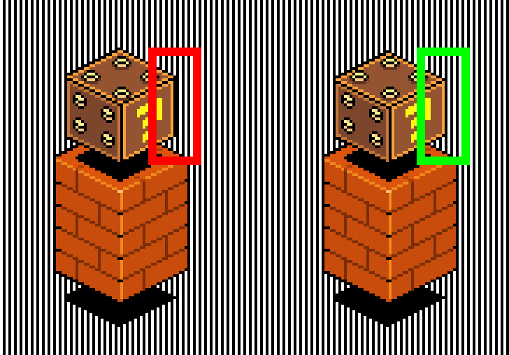

# Notes for Pixel Art Creators (wip)

### Check TiliX
Go check the [TiliX Reference on GitHub](https://c6y.github.io/tilix-reference/). Understand the grid system PHI is based on, and avoid some common pitfalls.

### Prepare for the Unknown

PHI creators should take into account that TiliX objects are modular and will be re-used in changing contexts. An object that looks beautiful by itself, might be hard to decipher if it is placed in front of another object. Below you'll find a couple of notes that can help mitigate these issues.

* Always test your object next and in front of other random objects.
* Keep things as simple as possible (but not boring). You never know how your objects will be used.
* Overlapping objects will increase the chance of visual noise.
* Be aware of negative space and the background of an object.
* The areas in the negative spaces of the structure should not be too complicated, or users might end up with visual clutter.
* Be aware of the cells behind the object that will be affected by its shape.
* Prefer closed shapes over open irregular shapes.
* You have more freedom with the parts of the object that are placed in front of its own ground area.
* If an object has an important area, focus the main action here, and prepare for users to cover the less important areas with other objects.
* Place a grid on top of your objects and check if all lines are in sync, remove any double lines.

### Other Things to Consider

* The correct relative scale between objects is not super important. A car or a house doesn’t have to be so big that it can hold a person. It just has to be understood to be a car, or a house. We create symbols, not an actual physical city.
* Avoid large boring sides. You can add detail, or slim down the size of an object by removing parts of it.
* Objects cannot be mirrored once they live in PHI. So be sure to check the correct location of vertical lines (see [Tilix > Do not mirror objects](https://c6y.github.io/tilix-reference/)).
* You can counter detailed objects with flat simple graphical objects. Both have their place

### Debug your pixel lines
The easiest way to spot line problems is to use debugging wallpapers. Turn them on and spot lines that are out of sync.

* Check if your grid lines are in sync with the grid. Use the [grid lines debugging wallpaper](media/pixel-art/debug-grid-lines@4x.png).

* Check if your main vertical lines are in sync with the vertical grid. Use the [vertical lines debugging wallpaper](media/pixel-art/debug-vertical-lines@4x.png).

### References
##### File Templates
* [TiliX grid](https://github.com/c6y/tilix-reference/tree/master/media/assets)
* [Debug grid lines (wallpaper)](media/pixel-art/debug-grid-lines@4x.png)
* [Debug vertical lines (wallpaper)](media/pixel-art/debug-vertical-lines@4x.png)

##### Colors
* PHI-blue &nbsp; #8080ff &nbsp;
* PHI-red &nbsp; #ff8080 &nbsp;
* PHI-green &nbsp; #80ff80 &nbsp;
