# Brand Notes (wip)

## The PHI Logo

> `TL;DR` The PHI logo is built out of isometric blocks. It can be drawn with pixels and with vectors, or you can build one yourself.

This is our logo.

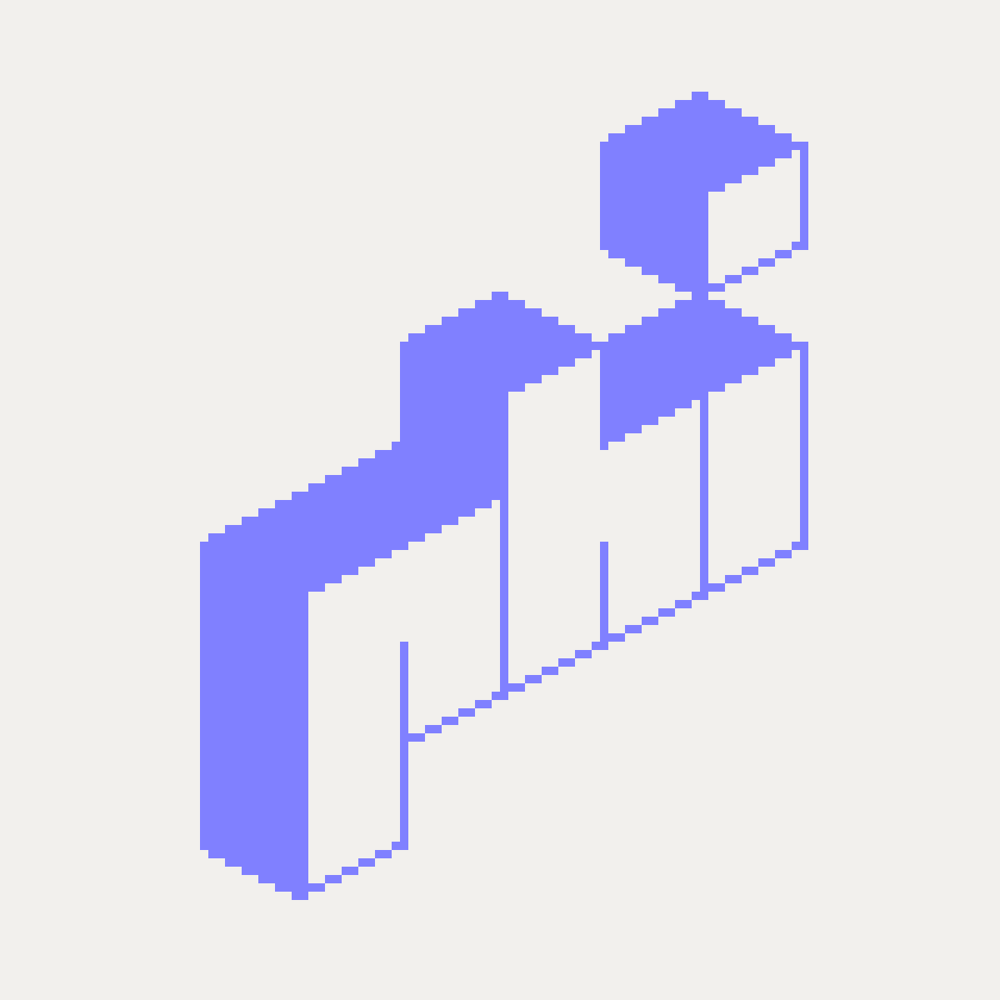

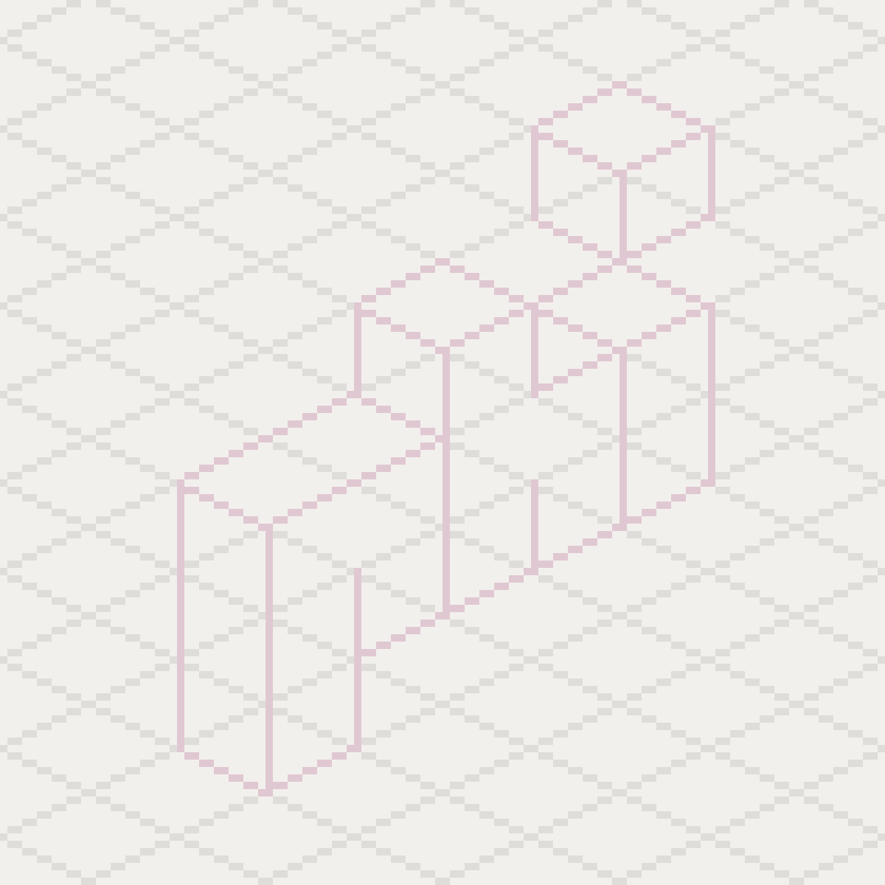

The logo is built out of 13 isometric blocks. Because the logo is isometric, it can naturally live in PhilLand, PHI's isometric pixel world.

Those 13 isometric blocks, translated into vector art.

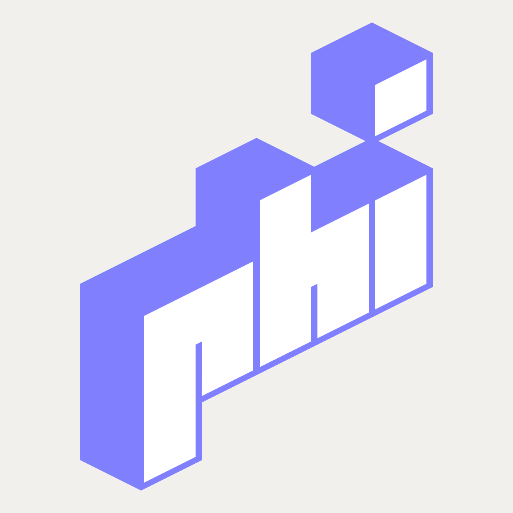

#### When to use the Pixel Logo
In a low resolution pixel environment where each pixel has its precise location. Each pixel logo is optimized for exactly one pixel size. It cannot be scaled without losing the sharpness typical for pixel art. If you want to scale it, you need to redraw the whole thing.

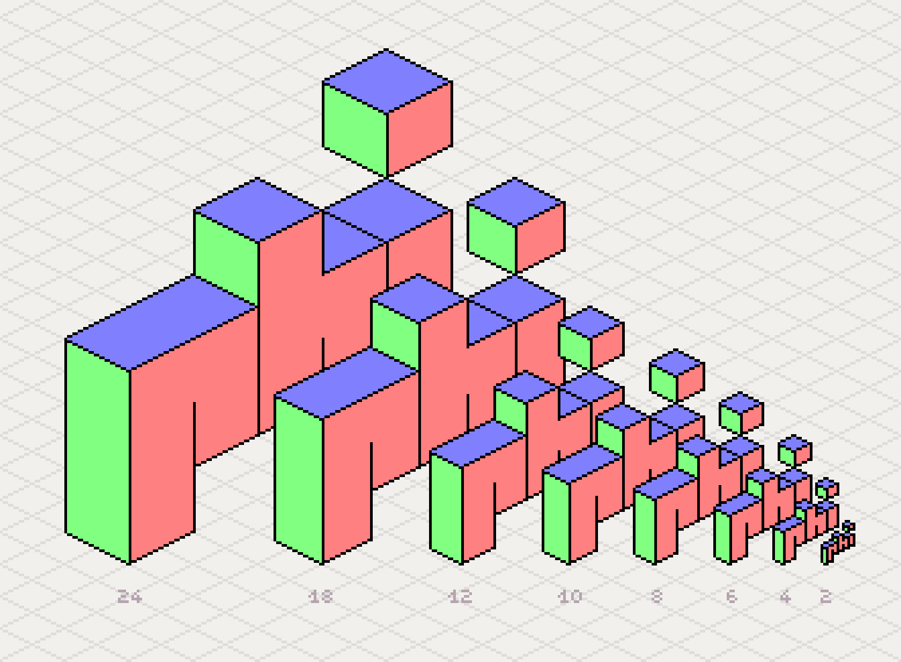

The pixel logo, hand drawn and optimized for different pixel sizes.

#### When to use the Vector Logo
Vector art on the other side, can be rotated, distorted and it can be scaled to any size, without having to redraw it. So it is very flexible.

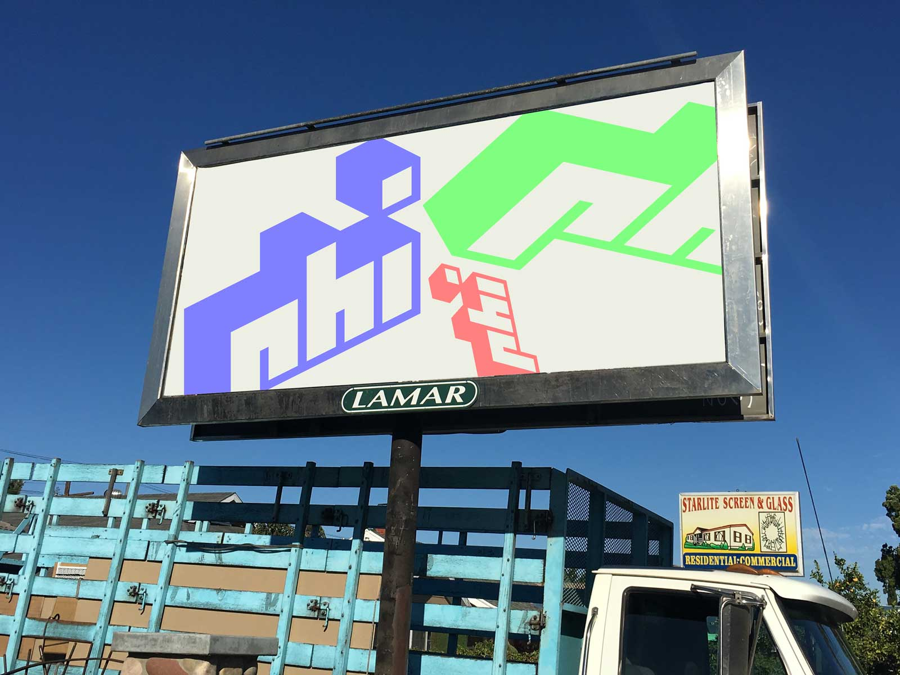

That said, when targeting very low resolutions, which are common in pixel art, vector art can 'run out of pixels'. Sometimes there are just not enough of them available to accurately draw the image. 

To compensate for this, vector art is displayed antialiased, which means lines are slightly blurred. At smaller sizes this often takes away from the crispness of the lines, everything will look a little mushy and out of focus. Because of this, vector art is better suited for high resolution screens and print media.

#### Build Your Own

Because the construction of the logo is very simple, you can do a lot of things with it. You can build your own PHI logo, explore, and have fun!

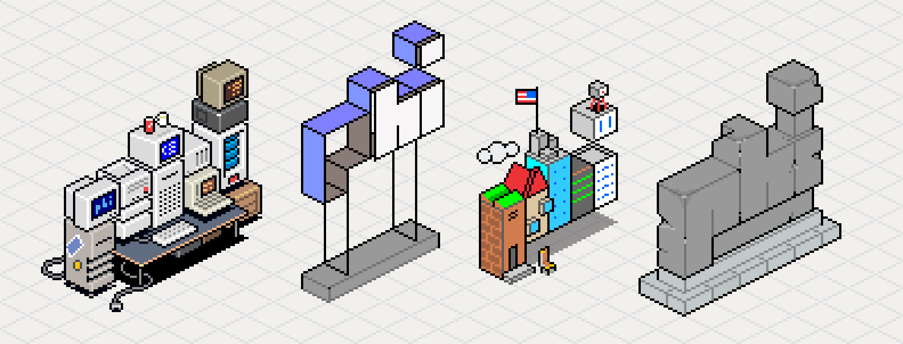
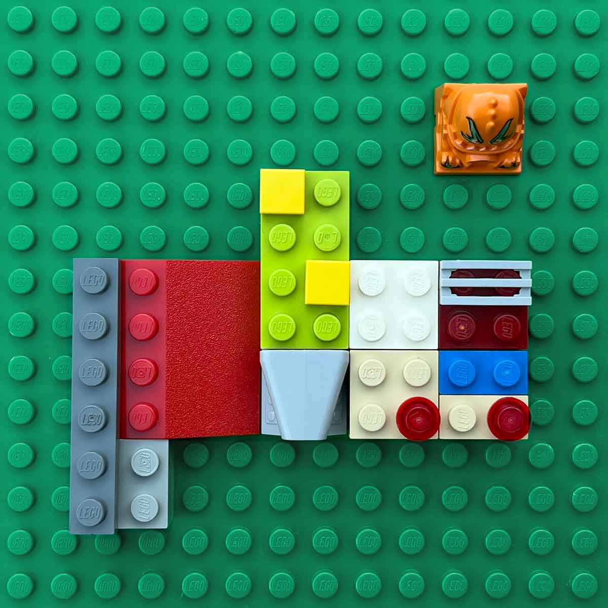
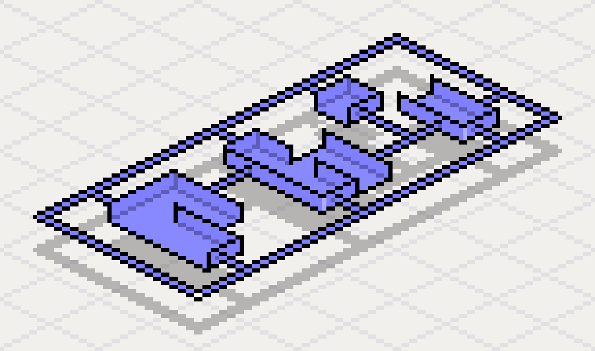
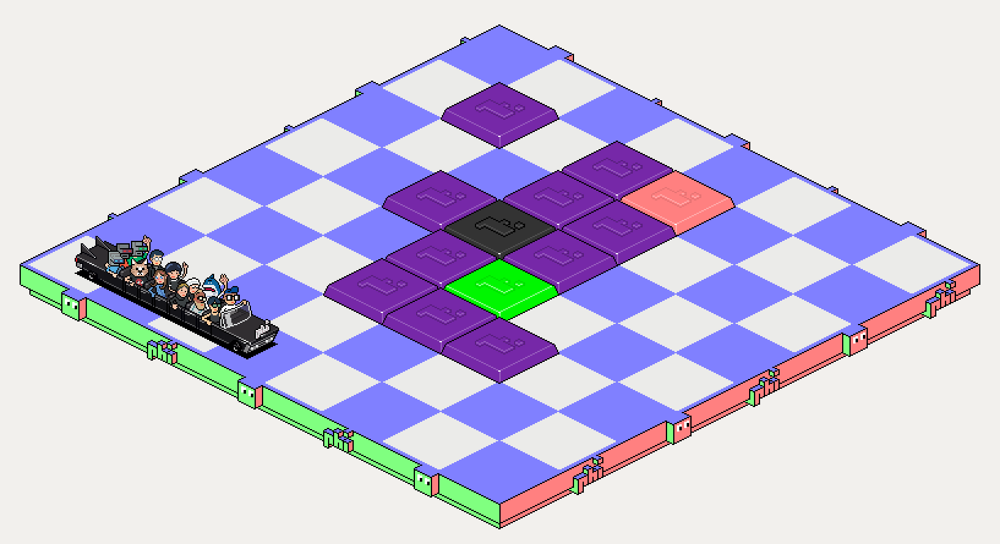

## Dotty

Dotty is our mascot.

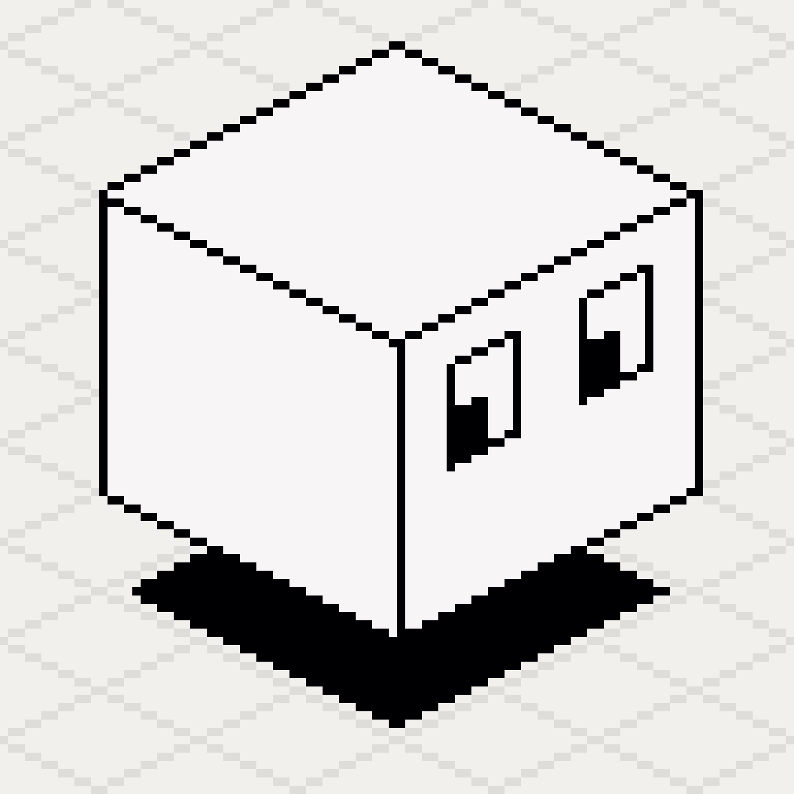

Here's the pixel version.

Dotty is constructed out of 1 isometric block.

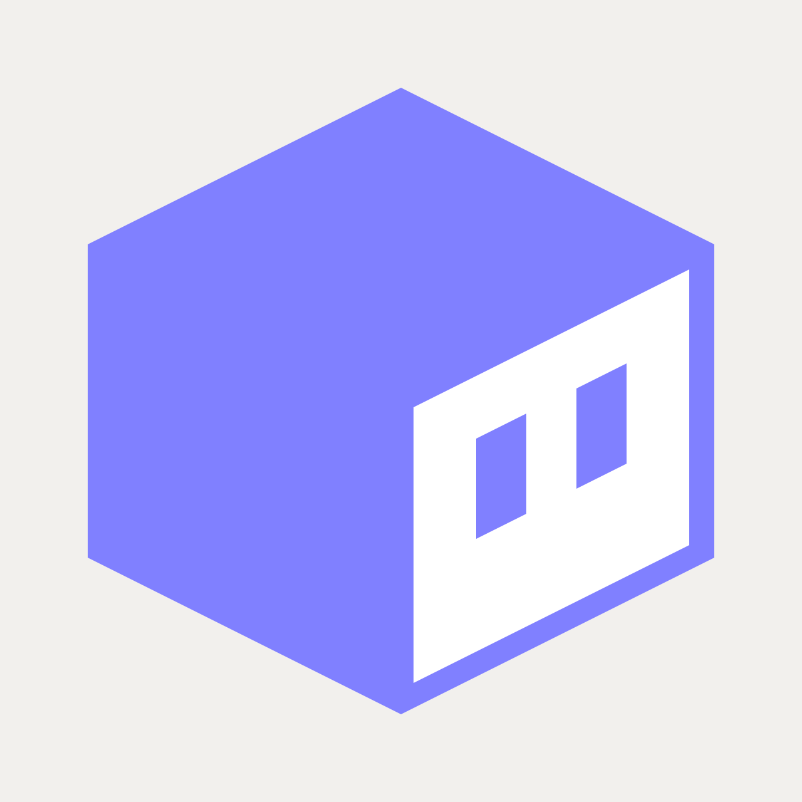

Created to be used outside of PhiLand, the vector version features simplified eyes.

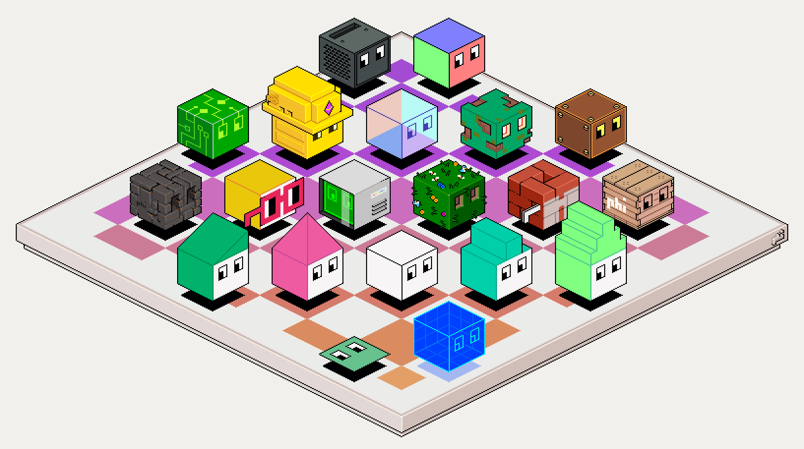

Dotty can be whatever you want. 

### Use Cases ###

- **Build for PhiLand.** When you create objects for PhiLand use the pixel assets. These are optimized for pixel display and come in a variety of sizes. You can use these as a starting point, or you can incorporate them directly into your art.

- **Produce Merchandise.** If you need to print the PHI logo or Dotty, consider the vector version. It will always render crisp, at any size. It also is more graphical, optimized for traditional print media situations. That said, in some situations, the pixel versions might look great as well, it really depends!

- **Have Fun.** Build your own. The system is simple.

### Normal vs Bold

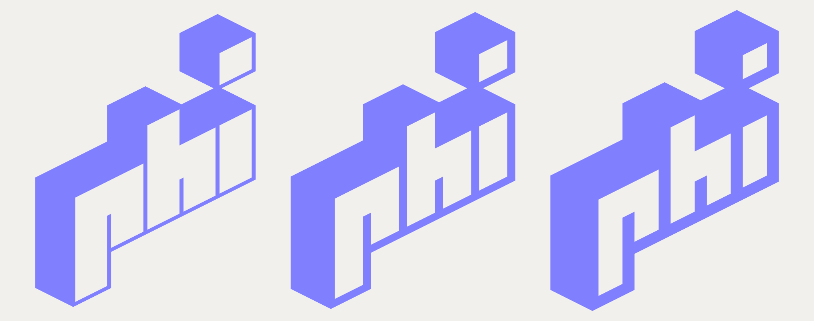
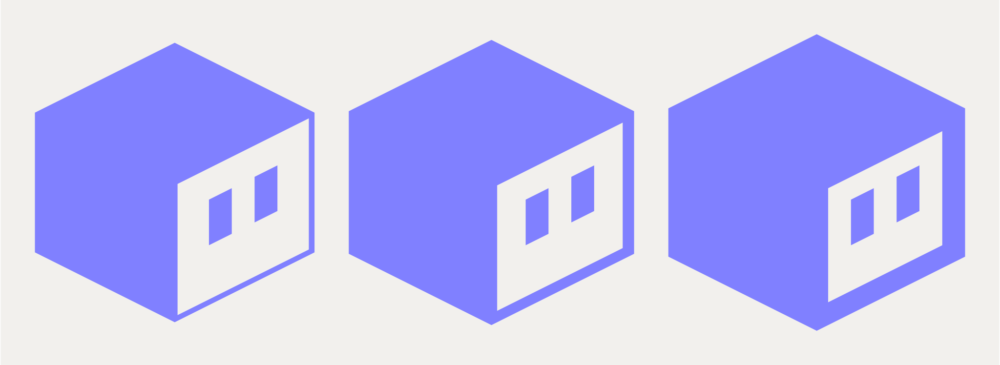

There are three vector variants of the PHI logo and Dotty: *thin*, *normal* and *bold*. Think of them as font weights. Use whichever version works better for your situation.

> `NOTE` If you're unsure, go for the *normal* weight.

## Colors
- PHI Blue `#8080ff`
- PHI Red `#ff8080`
- PHI Green `#80ff80`
- PHI Paper `#f2f0ed`

## Downloads
- [PHI logos, vector (EPS, SVG, PNG)](../assets/brand/logo/vector/)
- [PHI logos, pixels (PNG)](../assets/brand/logo/pixel)
- [Dotty, vector (EPS, SVG, PNG)](../assets/brand/dotty/vector)

## Links
- [PhiLand](https://philand.xyz/)
- [Notes for Pixel Art Creators](pixel-art-notes.md)
- [TiliX Reference](https://c6y.github.io/tilix-reference/)
- [How Does PhiLand Work](https://www.notion.so/phi-xyz/How-Does-Philand-Work-6c9b4132f9374926abd9fafcaf13596e)